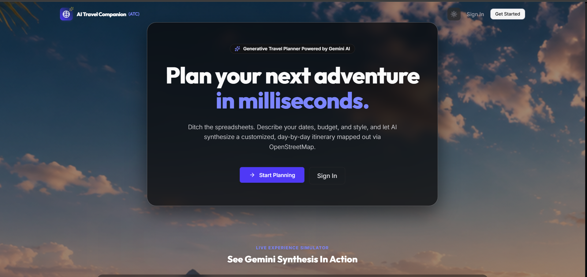
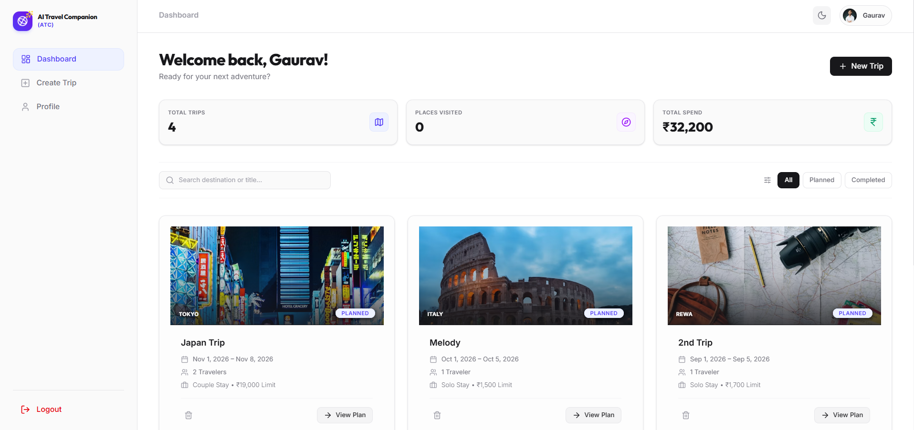
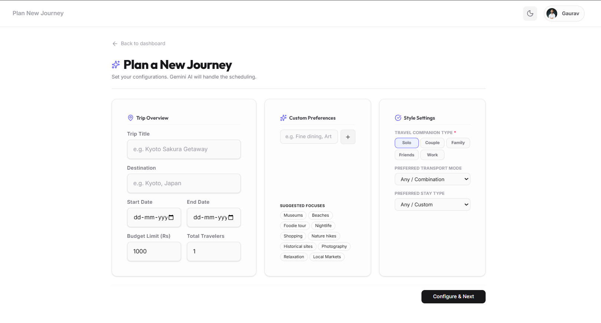
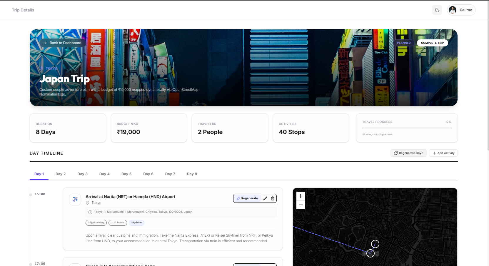
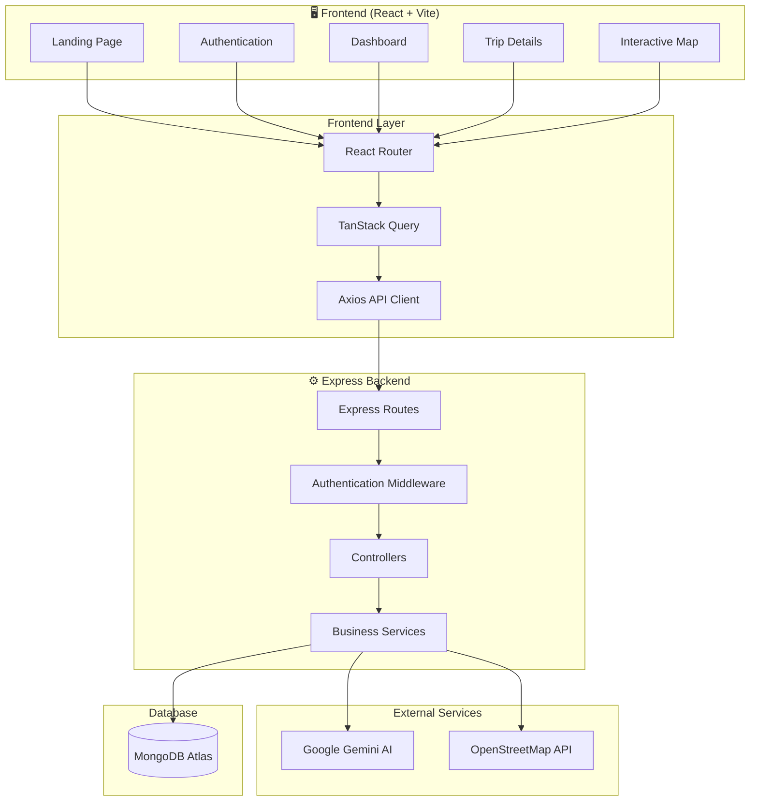
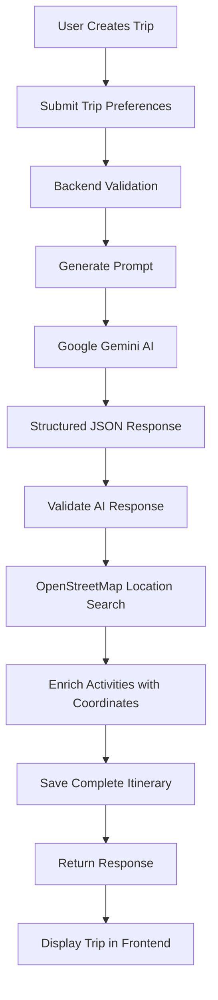
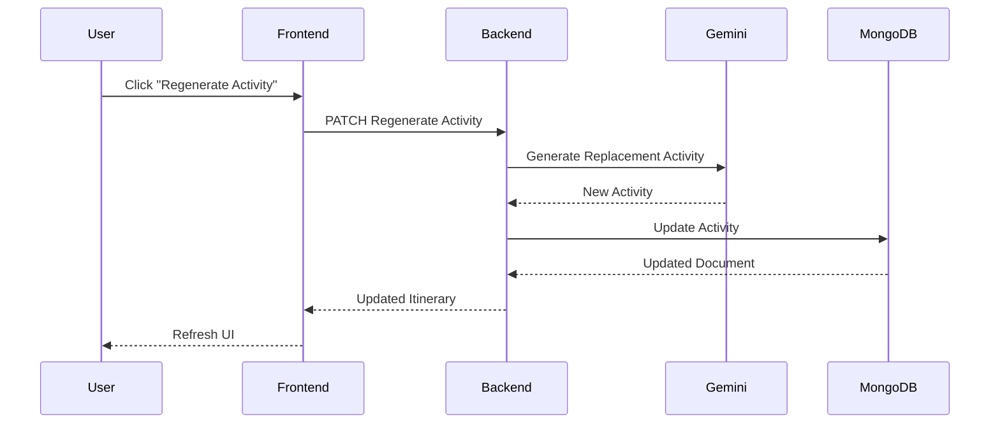

# 🌍 AI Travel Companion Platform

<div align="center">


### ✈️ Plan Smarter • Travel Better • Powered by AI

A modern **AI-powered full-stack travel planning platform** that generates personalized travel itineraries using **Google Gemini AI**, enriches destinations with **OpenStreetMap**, and allows users to intelligently regenerate, edit, and customize every part of their journey.

Designed and built as a production-style MERN application with secure authentication, responsive UI, AI integration, and cloud deployment.

<br/>

🌐 **Live Demo:** https://ai-travel-companion-platform.vercel.app

</div>

---

# 📸 Application Preview

| Landing | Dashboard |
|----------|-----------|
|  |  |

| Create Trip | Itinerary |
|--------------|-----------|
|  |  |


# 📖 Overview

Planning a trip usually involves switching between multiple websites to discover destinations, attractions, restaurants, transportation, and schedules.

**AI Travel Companion Platform** simplifies this process by allowing users to describe their trip preferences once and letting AI generate a complete day-wise itinerary within seconds.

Unlike traditional travel planners, users are **never locked into AI-generated results**. Every itinerary remains fully customizable. Users can regenerate an entire day, regenerate individual activities, edit activities manually, add their own destinations, or remove unwanted suggestions while preserving the rest of the itinerary.

To provide richer travel information, every generated location is automatically enriched using **OpenStreetMap (Nominatim)** before being stored in MongoDB.

---


# 📚 Table of Contents

- [🚀 Features](#-features)
- [🛠 Tech Stack](#-tech-stack)
- [📸 Application Preview](#-application-preview)
- [🏗 System Architecture](#-system-architecture)
- [🤖 AI Itinerary Generation Workflow](#-ai-itinerary-generation-workflow)
- [🔄 Activity Regeneration Workflow](#-activity-regeneration-workflow)
- [📂 Project Structure](#-project-structure)
- [🚀 Getting Started](#-getting-started)
- [🔐 Environment Variables](#-environment-variables)
- [📡 API Reference](#-api-reference)
- [☁️ Deployment](#-deployment)
- [🧪 Testing](#-testing)

# ✨ Features

| Feature | Description |
|----------|-------------|
| 🤖 **AI Trip Planning** | Generate personalized itineraries using Google Gemini AI. |
| 🔄 **AI Regeneration** | Regenerate a complete day or a single activity. |
| 📍 **Location Enrichment** | OpenStreetMap (Nominatim) adds coordinates and addresses. |
| ✏️ **Editable Itinerary** | Add, edit, or delete activities anytime. |
| 🔐 **JWT Authentication** | Secure login using JWT and HTTP-only cookies. |
| 🔑 **Google OAuth** | Sign in securely using Google OAuth 2.0. |
| 👤 **Profile Management** | View and update user profile. |
| 🗂️ **Trip Dashboard** | Organize and manage all saved trips. |
| 🗺️ **Interactive Maps** | Leaflet + OpenStreetMap integration. |
| ⚡ **MERN Architecture** | React, Express, Node.js, and MongoDB Atlas. |
| 📱 **Responsive Design** | Optimized for desktop, tablet, and mobile. |
| ☁️ **Cloud Deployment** | Vercel + Render + MongoDB Atlas. |
| 🔒 **Production Security** | Password hashing, CORS, protected APIs. |
| 🚀 **Performance** | Parallel processing and optimized database queries. |

# 🛠 Tech Stack

## Frontend

| Technology | Purpose |
|------------|---------|
| React | UI Development |
| Vite | Build Tool |
| Tailwind CSS | Styling |
| React Router | Routing |
| TanStack React Query | Server State Management |
| Axios | API Communication |
| React Hook Form | Form Handling |
| Zod | Form Validation |
| Framer Motion | Animations |
| React Leaflet | Interactive Maps |

---

## Backend

| Technology | Purpose |
|------------|---------|
| Node.js | Runtime |
| Express.js | REST API |
| MongoDB Atlas | Database |
| Mongoose | ODM |
| JWT | Authentication |
| Cookie Parser | Cookie Management |
| Gemini AI | AI Itinerary Generation |
| OpenStreetMap API | Location Enrichment |

---

## Dev Tools

| Tool | Purpose |
|------|---------|
| Git | Version Control |
| GitHub | Repository Hosting |
| Postman | API Testing |
| VS Code | Development Environment |
| Render | Backend Deployment |
| Vercel | Frontend Deployment |

---

# 🏗️ System Architecture

The application follows a modern client-server architecture where the frontend communicates with a RESTful backend API. The backend integrates with Google Gemini AI for itinerary generation, OpenStreetMap for location enrichment, and MongoDB Atlas for persistent storage.



---

# 🤖 AI Itinerary Generation Workflow

The AI itinerary generation process consists of multiple stages to ensure the generated travel plan is both intelligent and enriched with accurate location information.



---

# 🔄 Activity Regeneration Workflow

Instead of regenerating the complete itinerary, users can selectively regenerate individual activities.



---

# 📂 Project Structure

```text
AI Travel Companion Platform
│
├── backend
│   ├── src
│   │   ├── config
│   │   │   └── db.js                      # MongoDB connection
│   │   │
│   │   ├── controllers
│   │   │   ├── auth.controller.js         # Authentication APIs
│   │   │   ├── trip.controller.js         # Trip & itinerary APIs
│   │   │   └── user.controller.js         # User profile APIs
│   │   │
│   │   ├── middleware
│   │   │   └── auth.middleware.js         # JWT authentication
│   │   │
│   │   ├── models
│   │   │   ├── trip.model.js              # Trip schema
│   │   │   └── user.model.js              # User schema
│   │   │
│   │   ├── routes
│   │   │   ├── auth.routes.js             # Authentication routes
│   │   │   ├── trip.routes.js             # Trip routes
│   │   │   └── user.routes.js             # User routes
│   │   │
│   │   ├── services
│   │   │   ├── activity.service.js        # Activity CRUD & regeneration
│   │   │   ├── auth.service.js            # Authentication logic
│   │   │   ├── gemini.service.js          # Gemini AI integration
│   │   │   ├── itinerary.service.js       # AI itinerary generation
│   │   │   ├── location.service.js        # OpenStreetMap enrichment
│   │   │   ├── trip.service.js            # Trip business logic
│   │   │   └── user.service.js            # User operations
│   │   │
│   │   ├── utils
│   │   │   ├── apiError.js                # Custom API errors
│   │   │   ├── generateToken.js           # JWT generation
│   │   │   └── trip.helper.js             # Trip helper functions
│   │   │
│   │   ├── app.js                         # Express app
│   │   └── server.js                      # Server entry point
│   │
│   ├── .env
│   ├── package.json
│   └── package-lock.json
│
├── frontend
│   ├── public
│   │   └── travel_vector_bg.png
│   │
│   ├── src
│   │   ├── components
│   │   │   ├── common
│   │   │   │   ├── Footer.jsx             # Footer component
│   │   │   │   └── ProtectedRoute.jsx     # Route protection
│   │   │   │
│   │   │   └── ui
│   │   │       ├── Button.jsx             # Reusable button
│   │   │       ├── Card.jsx               # Card component
│   │   │       ├── Input.jsx              # Input component
│   │   │       ├── Modal.jsx              # Modal component
│   │   │       ├── Skeleton.jsx           # Loading skeleton
│   │   │       └── Tabs.jsx               # Tabs component
│   │   │
│   │   ├── context
│   │   │   ├── AuthContext.jsx            # Authentication state
│   │   │   ├── ThemeContext.jsx           # Theme management
│   │   │   └── ToastContext.jsx           # Toast notifications
│   │   │
│   │   ├── layouts
│   │   │   ├── AppLayout.jsx              # Main application layout
│   │   │   ├── AuthLayout.jsx             # Authentication layout
│   │   │   └── PublicLayout.jsx           # Public layout
│   │   │
│   │   ├── pages
│   │   │   ├── Home.jsx                   # Landing page
│   │   │   ├── Login.jsx                  # Login page
│   │   │   ├── Register.jsx               # Register page
│   │   │   ├── Dashboard.jsx              # Dashboard
│   │   │   ├── CreateTrip.jsx             # Create trip page
│   │   │   ├── TripDetail.jsx             # Trip itinerary
│   │   │   └── Profile.jsx                # User profile
│   │   │
│   │   ├── services
│   │   │   ├── api.js                     # Axios instance
│   │   │   └── trip.service.js            # Frontend API services
│   │   │
│   │   ├── App.jsx                        # Root component
│   │   ├── main.jsx                       # React entry point
│   │   └── index.css                      # Global styles
│   │
│   ├── .env
│   ├── package.json
│   ├── package-lock.json
│   ├── vite.config.js
│   └── index.html
│
├── assets
│   ├── logo.png
│   └── screenshots
│
└── README.md
```

---

# 🚀 Getting Started

## Clone Repository

```bash
git clone https://github.com/Gaurav-Mishra-2005/ai-travel-companion-platform.git
cd ai-travel-companion-platform
```

---

## Backend Setup

```bash
cd backend
npm install
```

---

## Frontend Setup

```bash
cd frontend
npm install
```

---

## Run Backend

```bash
npm run dev
```

Backend starts on
```
http://localhost:8000
```
(Change the port if your project uses a different one.)

---

## Run Frontend

```bash
npm run dev
```

Frontend starts on

```
http://localhost:5173
```

---

# 🔐 Environment Variables

## Backend (.env)

```env
PORT=8000
MONGODB_URI=
JWT_SECRET=
JWT_EXPIRES_IN=
COOKIE_SECRET=
FRONTEND_URL=
GEMINI_API_KEY=
GOOGLE_CLIENT_ID=
GOOGLE_CLIENT_SECRET=
```

---

## Frontend (.env)

```env
VITE_API_URL=
VITE_GOOGLE_CLIENT_ID=
```

---

# 🔒 Security Features

The application follows modern authentication and security best practices.

- ✅ JWT Authentication
- ✅ Google OAuth 2.0 Authentication
- ✅ HTTP-only Secure Cookies
- ✅ Password Hashing using bcrypt
- ✅ Protected Backend Routes
- ✅ CORS Configuration
- ✅ Authentication Middleware
- ✅ Environment Variables Protection
- ✅ Input Validation
- ✅ Unauthorized API Access Prevention

---

# ⚡ Performance Optimizations

The project includes several optimizations to improve performance and user experience.

- React Query for server state caching
- Lazy API fetching
- Efficient MongoDB queries
- Parallel OpenStreetMap enrichment
- Modular backend services
- Responsive UI rendering
- Optimized React component structure

---


# 📡 API Reference

The backend exposes a RESTful API for authentication, trip management, AI itinerary generation, and itinerary customization.

---

## 🔐 Authentication

| Method | Endpoint | Description |
|----------|----------|-------------|
| POST | `/api/auth/register` | Register a new user |
| POST | `/api/auth/login` | Authenticate user |
| POST | `/api/auth/logout` | Logout current user |
| GET | `/api/auth/profile` | Get authenticated user profile |

---

## ✈️ Trip Management

| Method | Endpoint | Description |
|----------|----------|-------------|
| GET | `/api/trips` | Retrieve all trips |
| POST | `/api/trips` | Create a new trip |
| GET | `/api/trips/:tripId` | Retrieve trip details |
| PUT | `/api/trips/:tripId` | Update trip |
| DELETE | `/api/trips/:tripId` | Delete trip |

---

## 🤖 AI Itinerary

| Method | Endpoint | Description |
|----------|----------|-------------|
| POST | `/api/trips/:tripId/generate` | Generate AI itinerary |
| PATCH | `/api/trips/:tripId/regenerate-day` | Regenerate complete day |
| PATCH | `/api/trips/:tripId/regenerate-activity` | Regenerate single activity |

---

## ✏️ Activity Management

| Method | Endpoint | Description |
|----------|----------|-------------|
| POST | `/api/trips/:tripId/activity` | Add activity |
| PUT | `/api/trips/:tripId/activity/:activityIndex` | Update activity |
| DELETE | `/api/trips/:tripId/activity/:activityIndex` | Delete activity |

---

# ☁️ Deployment

The application is deployed as a cloud-native MERN stack.

| Service | Platform |
|----------|----------|
| Frontend | Vercel |
| Backend | Render |
| Database | MongoDB Atlas |
| AI Model | Google Gemini AI |
| Maps | OpenStreetMap (Nominatim) |

---

## Production Architecture

```text
                 User
                   │
                   ▼
        Vercel (React Frontend)
                   │
               HTTPS API
                   │
                   ▼
      Render (Express Backend)
          │              │
          │              │
          ▼              ▼
MongoDB Atlas      Google Gemini AI
          │
          ▼
 OpenStreetMap API
```

---

# 🧪 Testing

The project was tested throughout development using:

- Postman
- Browser Testing
- Responsive Device Testing
- MongoDB Atlas
- Production Deployment Testing

The following workflows were verified:

- User Registration
- User Login
- JWT Authentication
- Trip CRUD Operations
- AI Itinerary Generation
- Day Regeneration
- Activity Regeneration
- Activity CRUD Operations
- Map Integration
- Protected Routes
- Production Deployment

---


<div align="center">
👨‍💻 Author - <a href="https://github.com/Gaurav-Mishra-2005">Gaurav  Mishra</a>
</div>
